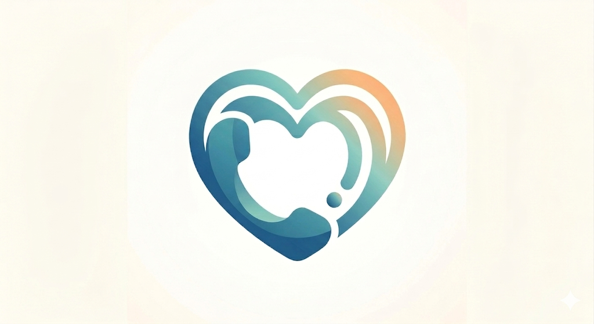
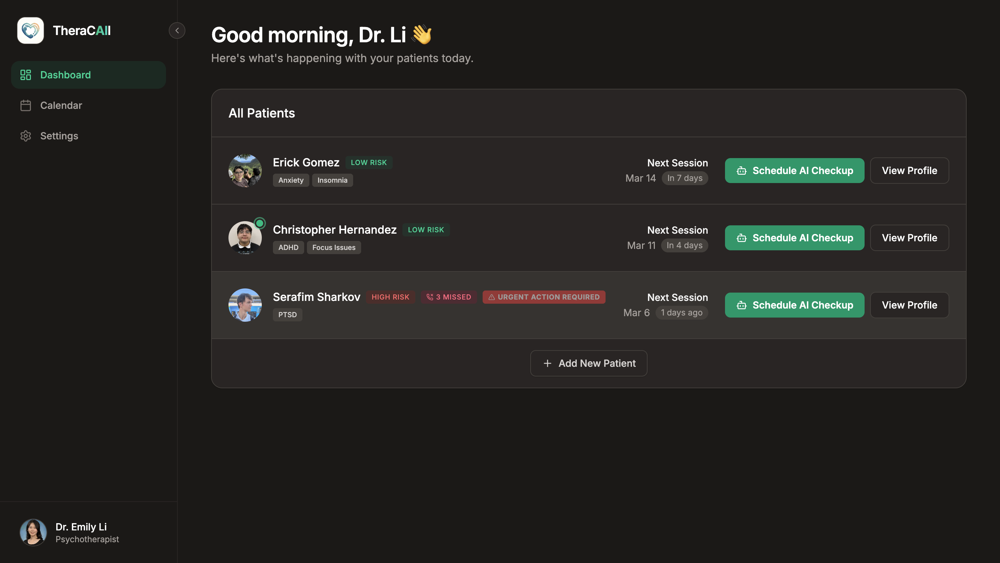
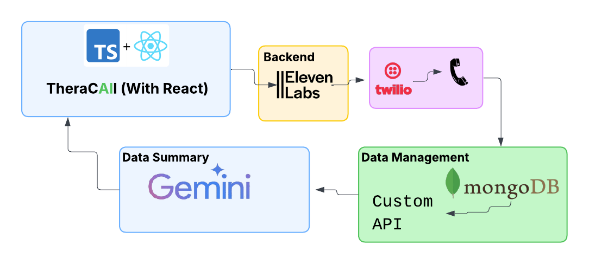
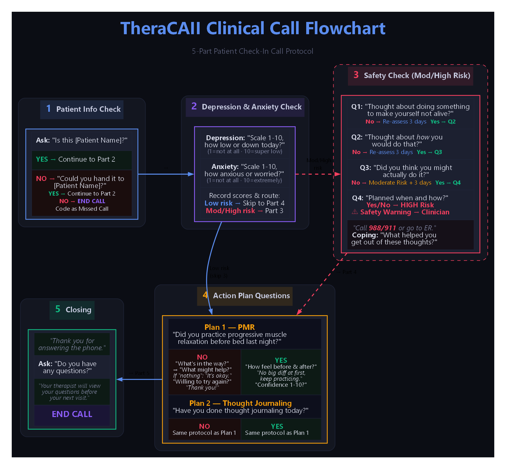

# TheraCaIl



TheraCaIl is an AI-based Treatment Alliance Aid for clinicians whose patients struggle to complete therapy action plans between sessions. It gives therapists a dashboard for patient status, triggers empathetic AI phone check-ins, summarizes patient responses, and flags urgent risk signals so clinicians can follow up faster.

**Devpost:** [devpost.com/software/theracail](https://devpost.com/software/theracail)
**GitHub:** [github.com/egomez714/TheraCaIl](https://github.com/egomez714/TheraCaIl)
**Demo video:** https://youtu.be/Q2bwVuf-Zf4?si=b2grXLFDcZSg5sYg
**Pitch video:** https://youtu.be/wQpIodQd1tY?si=aCFwFE-CUvhu9SYd

## Why We Built It

Therapy does not stop when a session ends. In Cognitive Behavioral Therapy, patients often leave with an action plan: concrete work like thought journaling, safety planning, or Progressive Muscle Relaxation. The gap is what happens next. Patients may go hundreds of hours before seeing their therapist again, and without timely support they can miss homework, disengage, or conclude that therapy is not working.

TheraCaIl was built to help clinicians close that between-session gap without adding another manual workflow to an already overloaded schedule.

## What It Does

- **AI-powered check-ins:** Calls patients with a structured protocol that checks basic status, depression and anxiety indicators, safety concerns, and action-plan progress.
- **Risk detection:** Flags high-risk responses, including suicidal ideation or other urgent safety concerns, for clinician review.
- **Action-plan support:** Follows up on the specific therapeutic homework assigned to a patient.
- **Clinician dashboard:** Organizes patients by risk level and highlights missed calls, urgent warnings, and recent AI-generated summaries.
- **Live updates:** Uses backend events and stored patient records so the dashboard reflects the latest call outcomes.

## Photos

### App Page



### Project Flow



### LLM Dynamic Script Flow



## How It Works

1. A clinician creates or selects a patient and assigns the patient's action plan.
2. The backend sends the call request to the voice agent with patient-specific context.
3. The AI voice agent calls the patient and follows a check-in protocol.
4. Call transcripts are sent back to the backend through a webhook.
5. Gemini analyzes the transcript and produces a concise clinician-facing summary.
6. MongoDB stores patient status, call history, missed calls, warnings, and analysis results.
7. The React dashboard updates so the clinician can review risk level and next actions.

## Tech Stack

- **Frontend:** React, TypeScript, Vite, Tailwind CSS, lucide-react
- **Backend:** Python, FastAPI, WebSockets
- **Database:** MongoDB
- **AI summary:** Gemini API
- **Voice AI:** ElevenLabs
- **Phone integration:** Twilio through ElevenLabs outbound calling
- **Webhook testing:** ngrok

## Repository Structure

```text
.
├── backend/
│   ├── main.py
│   ├── requirements.txt
│   └── database/
│       └── mongo_config.py
├── frontend/
│   ├── src/
│   ├── package.json
│   └── vite.config.ts
└── docs/
    └── assets/
```

## Run Locally

### Backend

```bash
cd backend
python3 -m venv .venv
source .venv/bin/activate
pip install -r requirements.txt
uvicorn main:app --reload
```

Create `backend/.env` with the service credentials used by the backend:

```bash
MONGO_URI=your_mongodb_connection_string
GEMINI_API_KEY=your_gemini_api_key
ELEVEN_LABS_KEY=your_elevenlabs_api_key
ELEVEN_LABS_AGENT_ID=your_elevenlabs_agent_id
ELEVEN_LABS_PHONE_ID=your_elevenlabs_phone_id
```

The backend runs at `http://localhost:8000`.

### Frontend

```bash
cd frontend
npm install
npm run dev
```

The frontend runs at `http://localhost:3000` and expects the backend at `http://localhost:8000`.

## API Overview

- `GET /api/patients` - returns all stored patient records for the dashboard.
- `GET /api/patients/{mrn}` - returns one patient by medical record number.
- `POST /api/trigger-call` - creates or updates a patient and starts an outbound AI check-in call.
- `POST /api/webhook/transcript` - receives call transcript data and stores AI analysis.
- `WS /ws/updates` - pushes live patient updates to connected frontend clients.

## Hackathon Notes

TheraCaIl was submitted to [HackMerced XI](https://devpost.com/software/theracail), where it won the JBL Tune 720BT prize. The project was built under hackathon constraints, so the next useful improvements are:

- Add an AI helper that helps clinicians draft action plans from a few bullet points.
- Expand the real-time patient condition table.
- Harden webhook validation and deployment configuration.
- Add a short demo video and a pitch walkthrough, then link them here and on Devpost.

## Video Links

Project walkthrough videos:

**Demo video:** https://youtu.be/Q2bwVuf-Zf4?si=b2grXLFDcZSg5sYg
**Pitch video:** https://youtu.be/wQpIodQd1tY?si=aCFwFE-CUvhu9SYd

## Links

- [Devpost submission](https://devpost.com/software/theracail)
- [GitHub repository](https://github.com/egomez714/TheraCaIl)
- [Post-hackathon asset checklist used for this README](https://www.thehackathonplaybook.dev/blog/what-to-do-after-a-hackathon)
